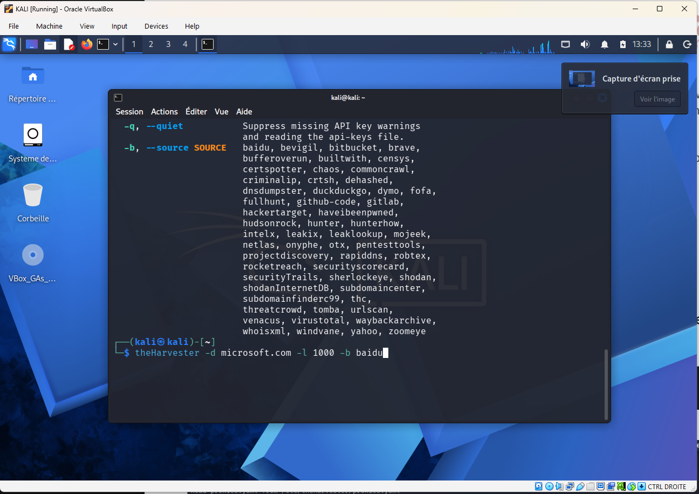
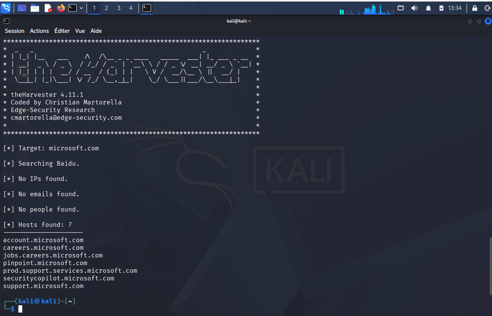
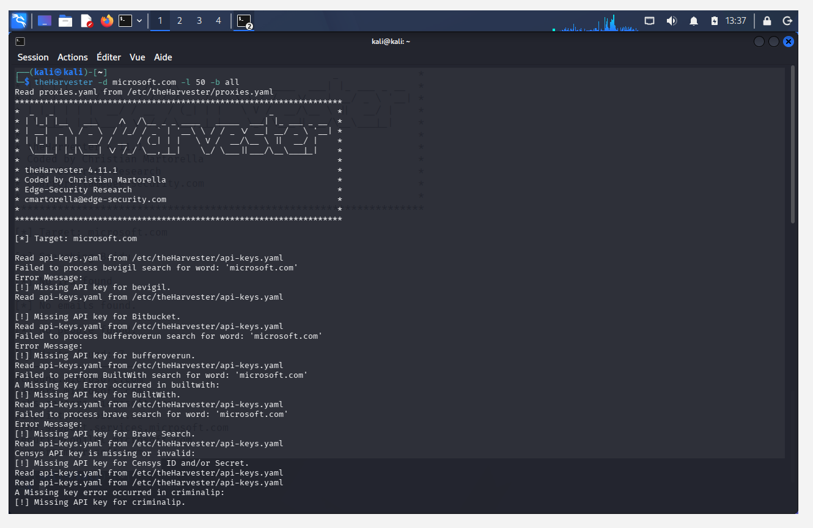
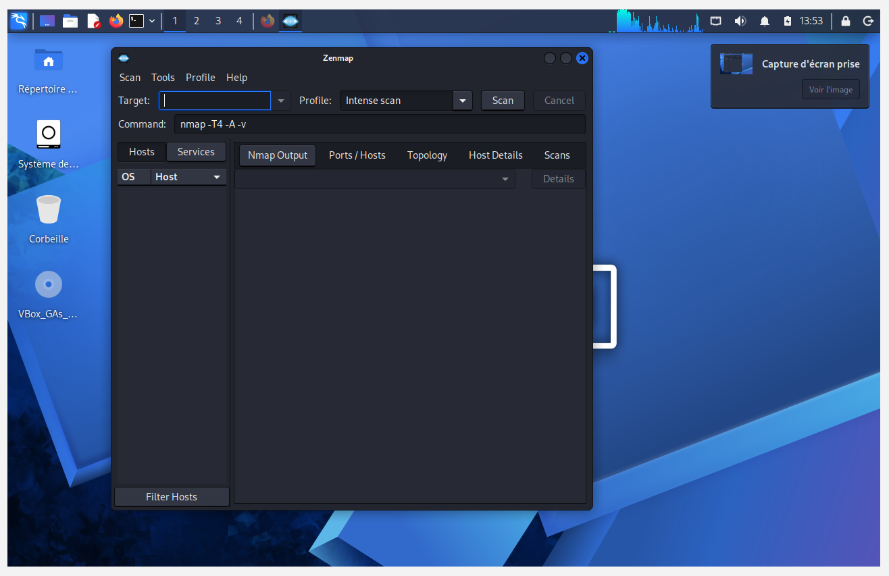
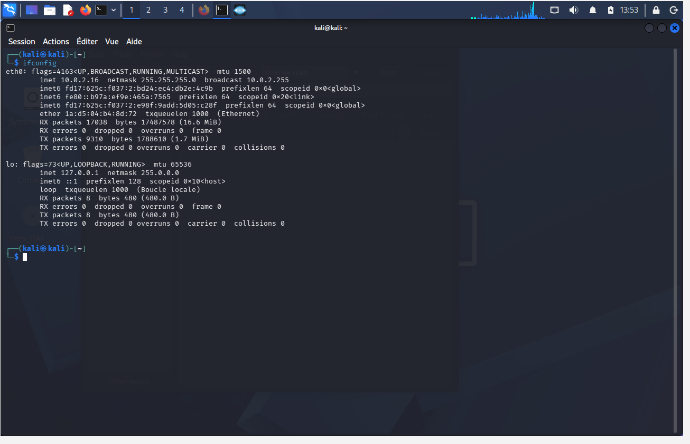
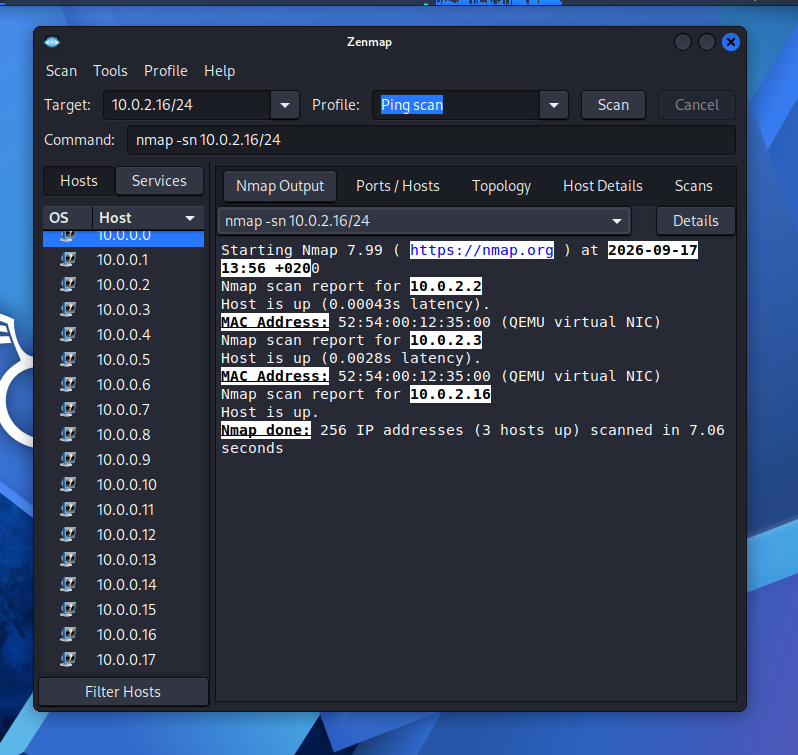
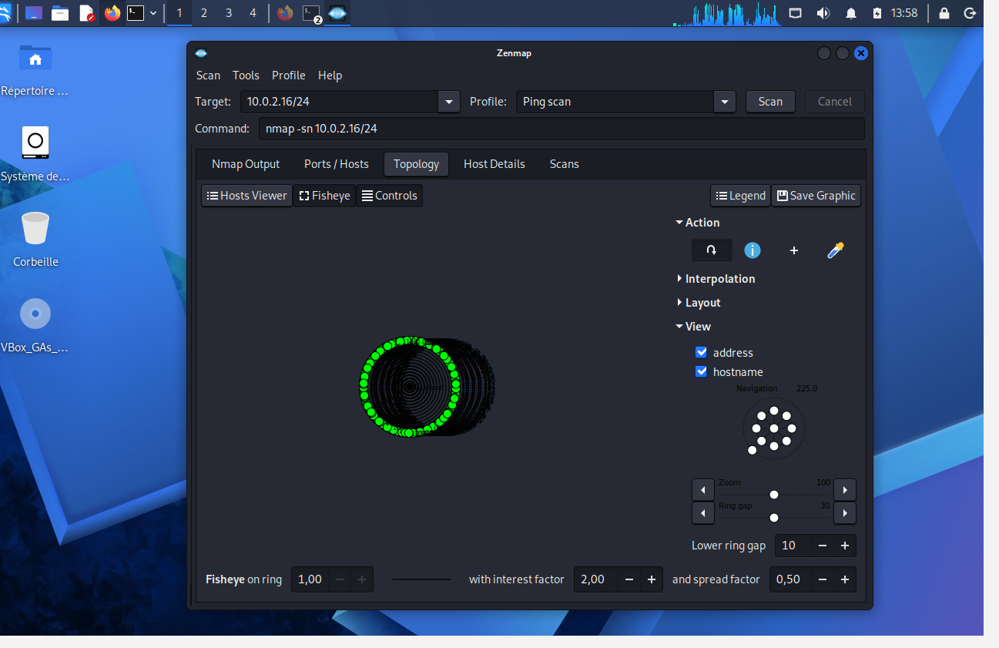

# Week 2 - Footprinting, Reconnaissance and Network Scanning

NetworkWalks Internship, Batch B082 - Week 2

Two modules:

| Module | Tool | Type |
|---|---|---|
| PM4 - Footprinting and Reconnaissance | theHarvester | Passive |
| Network Scanning | Zenmap / Nmap | Active |

The order is deliberate. Passive recon collects what is already public without
touching the target. Active scanning sends packets and shows up in logs. Doing
theHarvester first and Zenmap second is the same order a real engagement follows.

---

# Module PM4 - Footprinting with theHarvester

## What this is

Passive reconnaissance against `microsoft.com` using theHarvester in Kali Linux,
first through a single search engine and then across every source the tool supports.

Week 1 was about building the lab and keeping it isolated from my home network.
In this module nothing is attacked. The whole point is how much can be collected
about an organisation *before* sending it a single packet.

## Background

theHarvester gathers emails, sub-domains, hosts, employee names, open ports and
banners from public sources: search engines, PGP key servers, certificate
transparency logs and databases like SHODAN. It is written in Python and comes
pre-installed in Kali, so there was nothing to install.

The reason it matters is what the collected data becomes:

- **Every harvested email** is a candidate for phishing and password attacks.
- **Every sub-domain** is another door into the organisation, and often one the
  defenders have forgotten about. Old staging and test hosts are rarely patched
  to the same standard as the main site.

Because the tool only reads public data, the target never knows it is being
studied. That is what makes passive recon powerful and very hard to detect.
Defenders run the same tool against themselves to see what an attacker would see,
then reduce what they leak.

## Environment

Windows host, VirtualBox, Kali VM. Week 1 configured a static `10.0.0.2` on the
`NatNetwork`, but the VM is actually running on `10.0.2.16/24` this week - see
[Where the addressing went](#where-the-addressing-went) in the scanning module.
It makes no difference to theHarvester, which only needs outbound internet.

theHarvester version 4.11.1.

Worth noting: this is the first week the lab's internet access is doing real work.
In Week 1 it only served `apt update`. Here NAT is what lets Kali reach Baidu and the
other sources, while still keeping the VM off my home LAN.

## Scope

The target is `microsoft.com`, and I do not own it. What keeps this legitimate is
that no traffic is ever sent to Microsoft. theHarvester queries third-party search
engines and public databases and reads what they have already indexed. Microsoft's
infrastructure is never touched, so there is nothing to consent to.

This distinction is the whole passive/active line, and it is worth being precise
about. The moment I run something like `nmap` against the same domain, packets hit
their servers and it becomes a different activity with different legal standing.

## Launching the tool

theHarvester is in the Kali applications menu, though everything after this is
command line.


## Task 1 - Baidu, limit 1000

Find email IDs and sub-domains for `microsoft.com` using Baidu, limited to 1000
results.

```bash
theHarvester -d microsoft.com -l 1000 -b baidu
```

| Flag | Meaning |
|---|---|
| `-d` | target domain |
| `-l` | limit on number of results |
| `-b` | source to search |

The `-b` flag accepts a long list of sources. This screenshot catches the tail of
the help output listing them, with the Task 1 command typed underneath:



That list is worth reading rather than skipping. It includes `crtsh` (certificate
transparency), `hackertarget`, `shodan`, `haveibeenpwned` and `dnsdumpster` - very
different classes of source, which is why the choice of `-b` changes the results so
much.

### Result



```
[*] Target: microsoft.com

[*] Searching Baidu.

[*] No IPs found.

[*] No emails found.

[*] No people found.

[*] Hosts found: 7
---------------------
account.microsoft.com
careers.microsoft.com
jobs.careers.microsoft.com
pinpoint.microsoft.com
prod.support.services.microsoft.com
securitycopilot.microsoft.com
support.microsoft.com
```

Seven hosts, zero emails, zero people, zero IPs.

The empty results are not a failure, and they are the more interesting half of the
output. A limit of 1000 does not mean 1000 results exist - it caps what the tool
will accept. Baidu is one search engine, it indexes Microsoft lightly compared to
its coverage of Chinese-language sites, and search engines are a poor source for
email addresses in the first place. The limit was never the constraint here; the
source was.

The seven hosts that did come back are all public-facing and unremarkable, which is
what you would expect from an organisation the size of Microsoft. `pinpoint` and
`securitycopilot` are the two I would look at first if this were a real engagement,
simply because they are less familiar than `support` or `careers` and less
familiar often means less hardened.

## Task 2 - all sources, limit 50

Same target, every source, limit dropped to 50.

```bash
theHarvester -d microsoft.com -l 50 -b all
```

Run in a second terminal.



### What happened

The run immediately filled with warnings:

```
Read api-keys.yaml from /etc/theHarvester/api-keys.yaml
Failed to process bevigil search for word: 'microsoft.com'
[!] Missing API key for bevigil.
[!] Missing API key for Bitbucket.
[!] Missing API key for bufferoverun.
[!] Missing API key for BuiltWith.
[!] Missing API key for Brave Search.
[!] Missing API key for Censys ID and/or Secret.
[!] Missing API key for criminalip.
```

This is expected on a default Kali install and not an error I needed to fix. `-b all`
asks theHarvester to query every source it knows, and a large share of those are
commercial services requiring a registered key in `/etc/theHarvester/api-keys.yaml`.
With no keys configured, each one fails and the tool moves on. Only the free
sources actually return anything.

So `-b all` is misleading as a flag name. In practice it means "all sources you
have credentials for", and on a fresh install that is a much smaller set. Shodan
and Censys are exactly the sources that would produce the richest data, and they
are exactly the ones gated behind keys.

The lower limit of 50 matters far less than the missing keys. With Task 1 already
showing that the source constrains results rather than the limit, dropping 1000 to
50 was never going to be the bottleneck.

### Results

> **Incomplete.** The screenshot captures the start of the run, during the API key
> warnings, so the final counts are not recorded. Need to re-run this and capture
> the summary block at the end.

## Comparison

| | Task 1 | Task 2 |
|---|---|---|
| Source | `baidu` | `all` |
| Limit | 1000 | 50 |
| Hosts | 7 | not captured |
| Emails | 0 | not captured |
| API keys needed | none | most sources |

## Problems I ran into

**Expected emails, got none.** My first assumption was that a 1000 limit would
produce a long list of addresses. It produced none at all. Search engines index
web pages, and companies stopped publishing staff email addresses on web pages a
long time ago. Emails come from breach databases and PGP key servers, which are
different sources, and the good ones need API keys.

**Read the API key warnings as a broken install.** They are not. They are the tool
reporting, per source, that it cannot authenticate. The run continues on whatever
is free.

**Screenshotted Task 2 too early.** I captured the warnings scrolling past and not
the summary at the end, so I have no result counts for Task 2. The output is long
enough that the interesting part had not been reached yet. Next time, pipe to a
file and screenshot that:

```bash
theHarvester -d microsoft.com -l 50 -b all -f task2-results
```

The `-f` flag writes the results to HTML and JSON, which is more reliable than
scrollback anyway.

## To do

- Re-run Task 2 and capture the final summary.
- Try `-b crtsh`. Certificate transparency logs are free, need no key, and are a
  much better sub-domain source than any search engine - every TLS certificate
  issued is logged publicly, including for internal-sounding hosts.
- Register free API keys for one or two sources and compare the difference.

## What I took from this

The source matters more than the limit. I spent Task 1 thinking `-l 1000` was the
significant flag and it was not - `-b baidu` decided the outcome. A bigger limit on
a thin source returns the same thin results.

"All" is a claim about capability, not results. `-b all` looked like the thorough
option and quietly degraded to the free subset. Worth checking what a tool actually
did rather than what the flag implied, because the difference here is invisible
unless you read the warnings.

Empty output is still a finding. Zero emails from Baidu tells me something real
about where that data lives, and it is the kind of result that would be easy to
write off as the tool not working.

The asymmetry is what stays with me. Seven of Microsoft's sub-domains, from one
command, in a few seconds, from a VM on my desk, and nothing reached them. Whatever
detection Microsoft has, none of it saw this, because there was nothing to see.

---

# Module - Network Scanning with Zenmap

## What this is

Active reconnaissance inside my own lab network. Where theHarvester read public
records without touching anything, this module sends packets and asks machines
directly whether they are there.

Zenmap is the official GUI front end for Nmap. It builds the command for you, keeps
a history of scans, and draws a topology map from the results. The command line is
doing the same work either way - the Command box at the top of the window always
shows the `nmap` that is actually being run.

## Background

A ping scan, or host discovery, answers one question: which addresses on this
network have something alive on them. It does not check for open ports or try to
identify services. That comes after.

This is the first genuinely active thing in the week. Every host that replies has
received a packet from me and could have logged it. Inside my own NAT network that
does not matter, but the distinction is the reason this module comes second.

## Launching Zenmap

Zenmap opens on the "Intense scan" profile by default, with `nmap -T4 -A -v` in the
Command box.



That default is worth understanding before clicking Scan. `-A` enables OS detection,
version detection, script scanning and traceroute all at once, and `-T4` speeds it up
aggressively. It is loud, slow against a whole subnet, and far more than is needed to
answer "what is alive here". I changed the profile to Ping scan instead.

## Finding the network to scan

Before scanning a subnet you need to know which subnet you are on.

```bash
ifconfig
```



```
eth0: flags=4163<UP,BROADCAST,RUNNING,MULTICAST>  mtu 1500
      inet 10.0.2.16  netmask 255.255.255.0  broadcast 10.0.2.255
      ether 1a:d5:04:b4:8d:72  txqueuelen 1000  (Ethernet)
```

So the VM is on `10.0.2.16` with a `255.255.255.0` mask, making the local network
`10.0.2.0/24`.

## Where the addressing went

This is not the address Week 1 configured.

| | Week 1 | Now |
|---|---|---|
| Address | `10.0.0.2` | `10.0.2.16` |
| Network | `10.0.0.0/24` | `10.0.2.0/24` |
| Source | static, set manually | DHCP |

Two things say this is DHCP rather than the static configuration I set up:

- `.16` is a typical DHCP pool address. A manually assigned host would not land there.
- `10.0.2.0/24` is the VirtualBox default **plain NAT** network. The NAT Network I
  built in Week 1 was `10.0.0.0/24`.

So the adapter is on plain NAT, not the `NatNetwork`, and the static IP is not in
effect. Most likely the adapter got switched back to NAT at some point, which
discards the NAT Network attachment and the manual address with it.

Week 1 ended with a to-do about checking the DHCP pool range against the static
address. This is that problem showing up for real, from the other direction: not a
collision, but the static configuration silently not applying at all.

Worth flagging because it changes what the scan below actually proves. It is a scan
of the VirtualBox default NAT segment, not of the isolated multi-VM lab network
Week 1 set out to build.

## The ping scan

Target `10.0.2.16/24`, profile Ping scan.

```bash
nmap -sn 10.0.2.16/24
```

`-sn` means host discovery only, no port scan. Giving it `10.0.2.16/24` rather than a
single address tells Nmap to sweep all 256 addresses in the range.



```
Starting Nmap 7.99 ( https://nmap.org ) at 2026-09-17 13:56 +0200
Nmap scan report for 10.0.2.2
Host is up (0.00043s latency).
MAC Address: 52:54:00:12:35:00 (QEMU virtual NIC)
Nmap scan report for 10.0.2.3
Host is up (0.0028s latency).
MAC Address: 52:54:00:12:35:00 (QEMU virtual NIC)
Nmap scan report for 10.0.2.16
Host is up.
Nmap done: 256 IP addresses (3 hosts up) scanned in 7.06 seconds
```

## Reading the results

Three hosts out of 256, in 7 seconds.

| Address | MAC | What it is |
|---|---|---|
| `10.0.2.2` | `52:54:00:12:35:00` | VirtualBox NAT gateway |
| `10.0.2.3` | `52:54:00:12:35:00` | VirtualBox NAT DNS server |
| `10.0.2.16` | none shown | the Kali VM itself |

Three details in that output are worth stopping on.

**Both gateways share one MAC address.** `10.0.2.2` and `10.0.2.3` report the
identical `52:54:00:12:35:00`. On real hardware that would be a misconfiguration.
Here it is the giveaway that neither is a real machine - both are services presented
by the same piece of the VirtualBox emulated NAT engine, which answers on two
addresses using one virtual NIC.

**The MAC prefix identifies the virtualisation.** `52:54:00` is the QEMU/KVM OUI, and
Nmap resolves it to "QEMU virtual NIC" from its built-in vendor table. An attacker
landing on an unknown network reads this instantly: these are virtual machines, not
physical ones. MAC prefixes leak the hardware vendor for free, with no extra probing.
Week 1 saw the same effect from the other side - the Oracle `08:00:27` prefix on the
Kali adapter.

**No MAC for `10.0.2.16`.** Nmap learns MAC addresses from ARP, which only works on
the local segment and only for *other* machines. `10.0.2.16` is the host doing the
scanning, so there is no ARP exchange and no MAC to report. "Host is up" with no
latency figure is Nmap recognising it is scanning itself.

What is not here is also worth noting: no other VMs. Week 1 chose NAT Network
specifically so VMs could see each other, and this scan finds nothing but the
gateway, the DNS server and itself. Consistent with being on plain NAT, where each
VM is isolated in its own segment.

## Topology map

The Topology tab draws the discovered hosts as a graph.



The map shows the scanned range as a ring of nodes around the scanning host. With
only three live hosts on a flat network there is not much structure to draw - every
host is one hop away, so it renders as a single ring rather than anything branching.

Topology maps earn their place on larger networks with routers between segments,
where hop counts from traceroute produce actual depth. Here it mostly confirms the
network is flat.

Saved a copy with **Save Graphic**.

## Problems I ran into

**Scanned the wrong network without realising.** I went to type the Week 1 range and
`ifconfig` said otherwise. Checking the interface first is what caught it. Had I
scanned `10.0.0.0/24` from memory I would have got zero hosts up and probably blamed
Nmap rather than the adapter setting.

**Left the Intense scan profile selected at first.** `-T4 -A -v` against a /24 is a
long, noisy way to find out which hosts are alive. Ping scan answers that question
in 7 seconds.

**The exported topology PDF stayed inside the VM.** Saved it to the Kali desktop
rather than the Windows host, so the repo carries the screenshot instead. No loss -
the screenshot shows the same map - but worth remembering that anything saved inside
the guest needs moving across deliberately.

## To do

- Put the adapter back on `NatNetwork` and confirm `10.0.0.2` holds, then re-scan
  `10.0.0.0/24` and compare.
- Add the second VM Week 1 planned for, and re-run this scan to see it appear.
- Follow the ping scan with a port scan on a live host once there is a real target.

## What I took from this

Check the interface before trusting the plan. The lab was not on the network I
believed it was, and the only reason I know is that `ifconfig` came before the scan.
A configuration set up once in Week 1 was silently not in effect a week later.

MAC addresses are information. A repeated MAC on two addresses and a `52:54:00`
prefix together say "this is one emulated device, and this is a VM". Neither needed
a port scan to learn.

Absence is data. Three hosts where I expected a lab network is itself the finding
that something is wrong with the setup.

Host discovery is cheap and quiet by comparison. 256 addresses in 7 seconds with
`-sn`, against the minutes an Intense scan would take. Knowing what is alive first,
then scanning only those hosts, is both faster and less noisy than scanning
everything thoroughly.

---

## A note on use

The theHarvester module sent no traffic to Microsoft. Everything there was read from
third-party search engines and public databases that had already indexed the data.

The Zenmap module is active scanning, and it ran only against a virtual network on my
own machine.

That split is the point of the week. Passive recon against a third party is reading
public records. Active scanning against infrastructure you do not own can be an
offence in itself, regardless of whether anything is exploited afterwards. Keep it in
the lab.

## Author

Ghazi Smach
